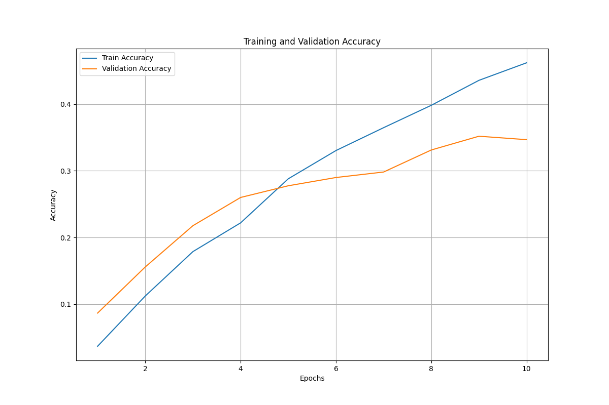

# LeNet Model Training on Pokémon Dataset

This project trains and saves a LeNet model using the Pokémon dataset. It also logs the training history and plots accuracy and loss.

## Table of Contents

- [Introduction](#introduction)
- [Requirements](#requirements)
- [Usage](#usage)
- [Results](#results)
- [File Description](#file-description)
- [Notes](#notes)
- [License](#license)

## Introduction

This project provides a way to train a LeNet model on the Pokémon dataset. The training process includes logging the history of accuracy and loss, and saving the trained model.

## Requirements

- Python 3.x
- torch
- torchvision
- pandas
- matplotlib

You can install the required packages using:
```bash
pip install torch torchvision pandas matplotlib
```

## Usage

To run the script, use the following command:
```bash
python miw_s22326_task03.py <input_file> <algorithm_type> <polynomial_degree>
```

- `<input_file>`: Path to the training data directory.
- `<algorithm_type>`: Type of algorithm to use (`closed` or `gradient`).
- `<polynomial_degree>`: Degree of the polynomial.

## Results

After running the script, you will get the following results:
- The trained model saved as `lenet_pokemon_model.pth`.
- Training history saved as `training_history.csv`.
- A plot of training and validation accuracy saved as `training_validation_accuracy_plot.png`.

### Accuracy Plot(5 epochs)


## File Description

- **miw_s22326_task03.py**: The main script for training the LeNet model.
- **lenet_pokemon_model.pth**: The saved trained model.
- **training_history.csv**: The CSV file containing the training history.
- **training_validation_accuracy_plot.png**: The plot of training and validation accuracy.

## Notes

- Ensure the dataset is structured correctly in the train and test directories before running the script.
- Adjust the hyperparameters as needed for better performance.

## License

This project is licensed under the MIT License. See the [LICENSE](LICENSE) file for details.
